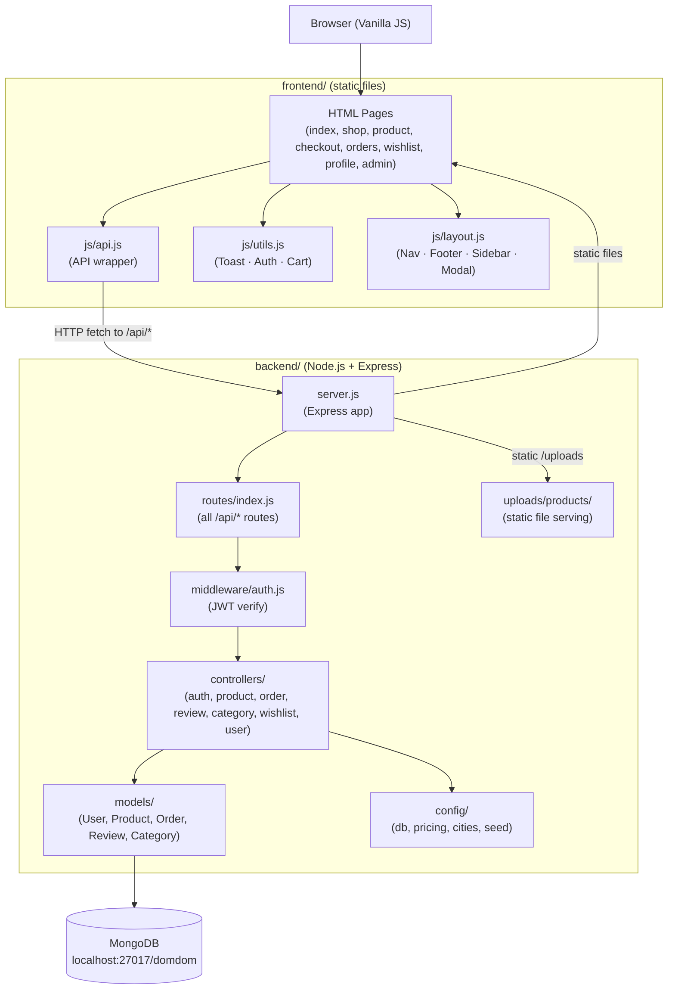
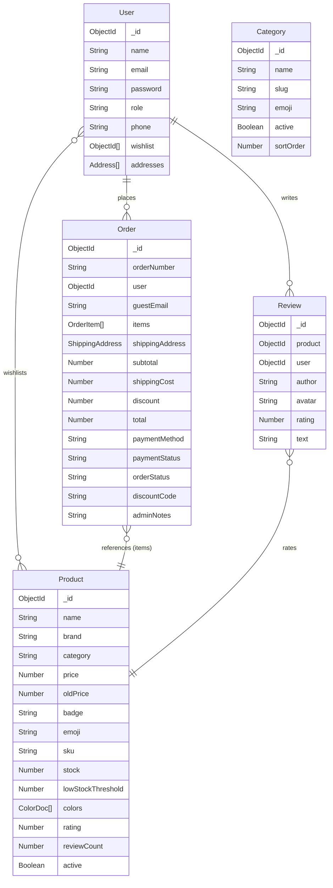
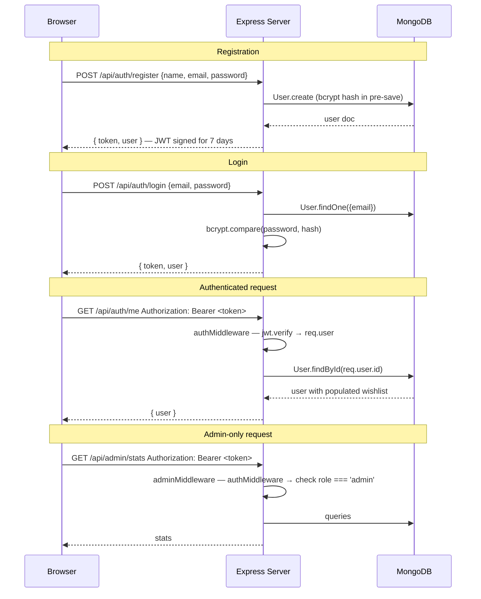

# PROJECT_CONTEXT.md — DomDom Store

> A complete architectural reference for the DomDom makeup e-commerce application.

---

## Table of Contents

1. [Project O   verview](#1-project-overview)
2. [Tech Stack](#2-tech-stack)
3. [Folder Structure](#3-folder-structure)
4. [Architecture Diagram](#4-architecture-diagram)
5. [Frontend Architecture](#5-frontend-architecture)
6. [Backend Architecture](#6-backend-architecture)
7. [Database Models & Relationships](#7-database-models--relationships)
8. [API Routes Reference](#8-api-routes-reference)
9. [Authentication & Authorization Flow](#9-authentication--authorization-flow)
10. [State Management](#10-state-management)
11. [Business Logic](#11-business-logic)
12. [Application Flow (User Journeys)](#12-application-flow-user-journeys)
13. [Configuration Files & Environment Variables](#13-configuration-files--environment-variables)
14. [Third-Party Services & Dependencies](#14-third-party-services--dependencies)
15. [Build & Deployment Structure](#15-build--deployment-structure)
16. [Known Entry Points](#16-known-entry-points)
17. [Admin Panel](#17-admin-panel)

---

## 1. Project Overview

**DomDom Store** is a full-stack Egyptian makeup and skincare e-commerce web application. It targets Egyptian consumers and operates with:

- Prices displayed in **Egyptian Pounds (EGP)**
- Shipping fees per Egyptian city (Cairo through Sinai)
- **Cash on Delivery (COD)** as the sole payment method
- Free shipping for orders over **3,000 EGP**
- A 5% markup automatically applied on all product base prices at display and order time
- A newsletter discount code: `DOMDOM15` (15% off first order — marketing only, not enforced server-side)

The store supports both **guest checkout** and **registered user** flows, and includes a full **admin dashboard** for product, order, category, and user management.

---

## 2. Tech Stack

| Layer | Technology |
|-------|-----------|
| **Runtime** | Node.js |
| **Web Framework** | Express.js 4.x |
| **Database** | MongoDB (via Mongoose 9.x) |
| **Authentication** | JWT (jsonwebtoken 9.x), bcryptjs 2.x |
| **File Upload** | Multer 1.x (local disk storage) |
| **Frontend** | Vanilla HTML + CSS + JavaScript (no framework) |
| **Fonts** | Google Fonts — Playfair Display, DM Sans |
| **Dev Tools** | nodemon (hot reload) |
| **Environment** | dotenv |

---

## 3. Folder Structure

```
domdom/
├── backend/                    # Node.js / Express API server
│   ├── server.js               # App entry point — Express setup, middleware, SPA fallback
│   ├── .env                    # Environment variables (PORT, MONGO_URI, JWT_SECRET)
│   ├── package.json            # Backend dependencies
│   ├── config/
│   │   ├── db.js               # Mongoose connection helper
│   │   ├── pricing.js          # MARKUP_RATE (5%), FREE_SHIPPING_THRESHOLD (3000 EGP)
│   │   ├── cities.js           # Egypt city list with per-city shipping fees
│   │   └── seed.js             # One-time DB seeder (admin user + sample products)
│   ├── controllers/
│   │   ├── authController.js   # Register, login, me, updateProfile, changePassword
│   │   ├── productController.js# CRUD + file upload (Multer), restock, category counts
│   │   ├── orderController.js  # Create order, my orders, admin all orders, status update, stats
│   │   ├── reviewController.js # Get/create/delete reviews, recalculates product rating
│   │   ├── categoryController.js# CRUD for categories
│   │   ├── wishlistController.js# Toggle/get/remove wishlist items
│   │   └── userController.js   # Admin: list all users, delete user
│   ├── middleware/
│   │   └── auth.js             # authMiddleware, adminMiddleware, optionalAuth
│   ├── models/
│   │   ├── user.js             # User schema with embedded addresses + wishlist refs
│   │   ├── Product.js          # Product schema with colors sub-doc, finalPrice virtual
│   │   ├── Order.js            # Order schema with embedded items + shipping
│   │   ├── Review.js           # Review schema linked to Product + User
│   │   └── Category.js         # Category with auto-slug generation
│   ├── routes/
│   │   └── index.js            # All API routes mounted under /api
│   └── uploads/
│       └── products/           # Uploaded product images served at /uploads/products/
│
└── frontend/                   # Static HTML/CSS/JS frontend
    ├── index.html              # Home page (hero, featured products, testimonials, newsletter)
    ├── css/
    │   ├── global.css          # CSS variables, buttons, forms, layout helpers, utility classes
    │   ├── nav.css             # Navigation, cart sidebar, auth modal, search overlay styles
    │   ├── home.css            # Hero, categories grid, about section, testimonials styles
    │   └── shop.css            # Shop page, product cards, filters sidebar, product detail
    ├── js/
    │   ├── api.js              # API wrapper (API object) — all fetch calls to backend
    │   ├── utils.js            # Toast, Auth, and Cart singletons (all in browser globals)
    │   └── layout.js           # renderNav(), renderFooter(), renderCartSidebar(), etc.
    ├── pages/
    │   ├── shop.html           # Browse + filter products page
    │   ├── product.html        # Single product detail + reviews + related products
    │   ├── checkout.html       # Shipping form + order summary + place order
    │   ├── orders.html         # User's order history
    │   ├── profile.html        # Account settings (name, email, phone, address, password)
    │   ├── wishlist.html       # Saved products wishlist
    │   ├── admin.html          # Admin dashboard (single-page with sidebar panels)
    │   ├── about.html          # Static about page
    │   └── contact.html        # Static contact page
    └── images/
        ├── cat-lips.jpg        # Category banner images
        ├── cat-eyes.jpg
        ├── cat-face.jpg
        ├── cat-skincare.jpg
        ├── favicon.png
        └── products/           # Legacy/seeded product images (older uploads)
```

---

## 4. Architecture Diagram



**Serving model:** Express serves the frontend static files directly. The SPA fallback (`GET *`) sends `frontend/index.html` for any non-API, non-asset route, allowing client-side navigation.

---

## 5. Frontend Architecture

### Design Pattern
The frontend is **vanilla JavaScript** with **no build step and no framework**. All JS is loaded as classic scripts. Three global singleton objects (defined in `utils.js`) and a layout module (`layout.js`) provide shared functionality across every page.

### Global Singletons (`frontend/js/utils.js`)

| Singleton | Responsibility |
|-----------|---------------|
| `Toast` | Displays transient notification toasts (success / error / info) |
| `Auth` | JWT token management, login/logout, user state, auth modal, UI updates |
| `Cart` | localStorage-backed cart — add/remove/update quantity, render cart sidebar |

All three are attached to `window.*` so every page script can access them.

### Layout Module (`frontend/js/layout.js`)

`initLayout()` is called on `DOMContentLoaded` on every page. It:
1. Renders the sticky navigation bar (`renderNav`)
2. Renders the footer (`renderFooter`)
3. Injects the cart sidebar HTML (`renderCartSidebar`)
4. Injects the auth modal HTML (`renderAuthModal`)
5. Injects the search overlay HTML (`renderSearchOverlay`)
6. Binds all event listeners for the above
7. Calls `Auth.init()` — verifies token, fetches current user
8. Calls `Cart.render()` — restores cart from localStorage
9. Initialises the scroll-reveal `IntersectionObserver`

### API Module (`frontend/js/api.js`)

All HTTP calls go through two helpers: `req()` (JSON) and `reqForm()` (multipart form-data). The `API` object groups methods by domain:

- `API.register / login / me / updateProfile / changePassword`
- `API.getCategories / createCategory / updateCategory / deleteCategory`
- `API.getProducts / getProduct / createProduct / updateProduct / deleteProduct / restockProduct`
- `API.placeOrder / myOrders / getOrder / allOrders / updateStatus`
- `API.getReviews / addReview / delReview`
- `API.getWishlist / toggleWishlist / removeWishlist`
- `API.getStats / getUsers / deleteUser`
- `API.subscribe` (newsletter)

Token is read from `localStorage('dd_token')` and sent as `Authorization: Bearer <token>` when `auth = true`.

### Page-by-Page Summary

| Page | Key Behaviour |
|------|--------------|
| `index.html` | Loads latest 8 products as featured cards; static testimonials; newsletter subscribe |
| `shop.html` | Loads categories from API; filter by category/price/badge; sort; grid/list toggle |
| `product.html` | Product detail via `?id=`; color picker; quantity selector; reviews; related products |
| `checkout.html` | Reads cart from localStorage; loads city list from API; calculates shipping; places order |
| `orders.html` | Lists user's orders (requires login) |
| `profile.html` | View/edit account info, manage addresses, change password |
| `wishlist.html` | Lists wishlisted products (requires login) |
| `admin.html` | Full admin dashboard (see §17) |

### CSS Architecture

| File | Scope |
|------|-------|
| `global.css` | CSS custom properties (`:root`), reset, typography, buttons, forms, badges, utilities, toast, spinner, modal, cart sidebar, footer |
| `nav.css` | Navigation bar, search overlay, auth modal, mobile menu |
| `home.css` | Hero section, marquee strip, category cards, about section, testimonials, newsletter |
| `shop.css` | Shop layout (sidebar + main), product cards, filters, product detail page, reviews, related grid |

**Design tokens** (CSS variables defined in `global.css `:root`):
- `--rose: #C8506E` — primary brand colour
- `--cream: #FAF6F1` — page background
- `--charcoal: #2A2323` — dark text
- `--gold: #C9A84C` — accent / stars / badges

### Responsive Breakpoints
- `≤ 1024px` — shop sidebar collapses; nav hamburger appears; 2-column product grid
- `≤ 600px` — single-column layouts; form rows stack

---

## 6. Backend Architecture

### Entry Point — `backend/server.js`

Startup sequence:
1. Load `.env` via dotenv
2. Connect to MongoDB (`connectDB()`)
3. Configure CORS (allows all origins, all standard methods)
4. Body parsers: JSON (10 MB limit), URL-encoded (10 MB limit)
5. Static serving: `/uploads` → `backend/uploads/`, and frontend files from `../frontend`
6. Mount all API routes at `/api`
7. Global error handler (4-argument Express middleware)
8. SPA fallback: any non-API `GET *` serves `frontend/index.html`
9. Listen on `PORT` (default 3000)

### Middleware

**`backend/middleware/auth.js`** exports three functions:

| Function | Behaviour |
|----------|-----------|
| `authMiddleware` | Requires valid Bearer JWT; attaches decoded payload to `req.user`; 401 on failure |
| `adminMiddleware` | Calls `authMiddleware`, then checks `req.user.role === 'admin'`; 403 if not admin |
| `optionalAuth` | Tries to verify JWT but **always calls `next()`** — `req.user` may be null |

### Request Flow

```
Client Request
    → CORS middleware
    → Body parser
    → Static file check (uploads / frontend)
    → /api/* router
        → (optional) authMiddleware / adminMiddleware
        → Controller function
            → Mongoose model query
            → Response JSON
    → Global error handler (catches thrown errors)
    → SPA fallback (non-API GET)
```

### Controllers

| Controller | Key Operations |
|------------|---------------|
| `authController` | Register (create user + issue JWT), Login (bcrypt compare + JWT), Me (populate wishlist), UpdateProfile (update name/email/phone/default address), ChangePassword |
| `productController` | Multer upload config, CRUD, soft-delete (`active: false`), restock (`$inc`), category counts (aggregation), ObjectId validation guard |
| `orderController` | Create (validates stock, deducts stock, calculates shipping by city, supports guest), MyOrders, AllOrders (admin), UpdateStatus (admin), GetStats (aggregation) |
| `reviewController` | GetAll (filter by productId), Create (recalculates product `rating` + `reviewCount`), Remove (owner or admin) |
| `categoryController` | CRUD; auto-slug on create (also auto-generated by model pre-save hook) |
| `wishlistController` | GetWishlist (populated), ToggleWishlist (push/splice), RemoveFromWishlist |
| `userController` | GetAllUsers (admin, excludes password), DeleteUser (admin, cannot self-delete) |

---

## 7. Database Models & Relationships

### Entity-Relationship Overview



### Model Details

#### User (`backend/models/user.js`)
- `role`: `'user'` | `'admin'` (default `'user'`)
- `wishlist`: array of `ObjectId` refs to Product
- `addresses`: embedded array of `addressSchema` (`{ fullName, phone, city, area, address, postalCode, isDefault }`)
- Pre-save hook: bcrypt-hashes password when modified (`cost factor 12`)
- Instance method: `comparePassword(candidate)` — bcrypt compare

#### Product (`backend/models/Product.js`)
- `category`: free string matching a `Category.slug`
- `colors`: embedded array of `colorSchema` (`{ name, hex, images[] }`) — images are URL paths to uploaded files
- `finalPrice` virtual: `price * 1.05` (5% markup via `applyMarkup`)
- Text index on `name`, `description`, `sku` (used by search regex; not full-text search)
- Soft delete: `active: false` (admin delete sets this flag)

#### Order (`backend/models/Order.js`)
- `orderNumber`: auto-generated `ORD-{base36 timestamp}-{4-char random}` in pre-save hook
- `user`: nullable — null for guest orders
- `items`: embedded `orderItemSchema` — snapshot of product name/emoji/photo/price at time of order (denormalised so order history survives product changes)
- `paymentMethod`: always `'COD'`
- `paymentStatus`: `Pending` | `Paid` | `Refunded`
- `orderStatus`: `Pending` | `Processing` | `Shipped` | `Delivered` | `Cancelled`

#### Review (`backend/models/Review.js`)
- Each review creation triggers recalculation of `Product.rating` and `Product.reviewCount`

#### Category (`backend/models/Category.js`)
- Pre-save hook auto-generates `slug` from `name` (lowercase, hyphenated, alphanumeric only)
- Products reference categories by slug string (not ObjectId)

---

## 8. API Routes Reference

All routes are prefixed with `/api`.

### Authentication

| Method | Path | Auth | Description |
|--------|------|------|-------------|
| POST | `/auth/register` | — | Create account, returns JWT |
| POST | `/auth/login` | — | Login, returns JWT |
| GET | `/auth/me` | User | Get current user (with populated wishlist) |
| PUT | `/auth/profile` | User | Update name, email, phone, default address |
| POST | `/auth/change-password` | User | Change password (verifies current) |

### Categories

| Method | Path | Auth | Description |
|--------|------|------|-------------|
| GET | `/categories` | — | Active categories sorted by sortOrder |
| GET | `/categories/admin/all` | Admin | All categories including inactive |
| POST | `/categories` | Admin | Create category |
| PUT | `/categories/:id` | Admin | Update category |
| DELETE | `/categories/:id` | Admin | Hard-delete category |

### Products

| Method | Path | Auth | Description |
|--------|------|------|-------------|
| GET | `/products` | — | Active products; query: `category`, `badge`, `search`, `sort`, `minPrice`, `maxPrice` |
| GET | `/products/categories/list` | — | Category counts from active products (aggregation) |
| GET | `/products/admin/all` | Admin | All products (including inactive) |
| GET | `/products/:id` | — | Single product + 4 related products |
| POST | `/products` | Admin | Create product with multipart images (up to 20 files) |
| PUT | `/products/:id` | Admin | Update product with optional new images |
| DELETE | `/products/:id` | Admin | Soft-delete (sets `active: false`) |
| PATCH | `/products/:id/restock` | Admin | Increment stock by `quantity` |

### Orders

| Method | Path | Auth | Description |
|--------|------|------|-------------|
| POST | `/orders` | Optional | Place order (guest or authenticated) |
| GET | `/orders` | User | My orders (by userId or guestEmail) |
| GET | `/orders/admin/all` | Admin | All orders with user population |
| GET | `/orders/:id` | User | Single order (owner or admin only) |
| PATCH | `/orders/:id/status` | Admin | Update orderStatus / paymentStatus / adminNotes |

### Reviews

| Method | Path | Auth | Description |
|--------|------|------|-------------|
| GET | `/reviews` | — | All reviews; query: `productId` |
| POST | `/reviews` | User | Create review (recalculates product rating) |
| DELETE | `/reviews/:id` | User | Delete own review (or admin can delete any) |

### Wishlist

| Method | Path | Auth | Description |
|--------|------|------|-------------|
| GET | `/wishlist` | User | Get wishlist with full product data |
| POST | `/wishlist/:productId` | User | Toggle (add/remove) product from wishlist |
| DELETE | `/wishlist/:productId` | User | Remove product from wishlist |

### Admin

| Method | Path | Auth | Description |
|--------|------|------|-------------|
| GET | `/admin/stats` | Admin | Dashboard stats + recent orders + low stock products |
| GET | `/admin/users` | Admin | All non-admin users |
| DELETE | `/admin/users/:id` | Admin | Delete user (cannot self-delete) |

### Shipping & Newsletter

| Method | Path | Auth | Description |
|--------|------|------|-------------|
| GET | `/shipping/cities` | — | Egypt cities + shipping fees |
| POST | `/newsletter/subscribe` | — | Email capture; returns discount code `DOMDOM15` |
| GET | `/api/health` | — | Health check `{ status: 'ok', time }` |

---

## 9. Authentication & Authorization Flow



**JWT payload** contains: `{ id, name, email, role }`. Token lifetime: **7 days**.

**Token storage**: `localStorage('dd_token')`. User data also cached in `localStorage('dd_user')`.

**Admin credentials** (seeded): `admin@domdom.com` / `password123`

**Route protection levels:**
- Public — no token needed
- `authMiddleware` — valid user token required
- `adminMiddleware` — valid admin token required
- `optionalAuth` — token used if present but request allowed regardless

---

## 10. State Management

There is no framework-based state management. State lives in three places:

### 1. Browser `localStorage`
| Key | Value |
|-----|-------|
| `dd_token` | JWT string |
| `dd_user` | JSON-serialised user object (cached) |
| `dd_cart` | JSON-serialised cart items array |

### 2. In-Memory Module Singletons

| Singleton | In-memory state |
|-----------|----------------|
| `Auth` | `currentUser` — hydrated from `API.me()` on page load |
| `Cart` | `items` — loaded from localStorage, mutated by add/remove/updateQty |

### 3. Page-Level Variables

Each page declares its own local variables (e.g., `let allProducts = []` in `shop.html`, `let product = null` in `product.html`). These are not shared across pages.

### Cart Persistence Across Pages

The Cart sidebar is rendered by `layout.js` on every page, and `Cart.render()` restores the cart from localStorage. This means cart state survives page navigation without any server-side session.

---

## 11. Business Logic

### Pricing

Defined in `backend/config/pricing.js`:
- `MARKUP_RATE = 0.05` — 5% added on top of every product's stored `price`
- `applyMarkup(price)` → `price * 1.05` rounded to 2 decimal places
- `FREE_SHIPPING_THRESHOLD = 3000` EGP — orders at or above this get free shipping
- `finalPrice` is a **Mongoose virtual** on Product; also computed in `withFinalPrice()` helper in productController for `.lean()` queries

### Shipping Fees

Defined in `backend/config/cities.js`:
- 28 named Egyptian cities/areas with explicit fees (50–95 EGP)
- Unknown city defaults to 95 EGP
- Logic: `subtotal >= 3000 → shippingCost = 0`, otherwise `getShippingFee(city)`

### Order Creation Flow

1. Validate required shipping fields
2. For each cart item: fetch product, validate stock, deduct stock immediately (`product.stock -= qty; await product.save()`)
3. Calculate `finalPrice = applyMarkup(product.price)` per item
4. Sum `subtotal`, determine `shippingCost`, compute `total`
5. Persist `Order` document (stock is already deducted at this point)
6. `orderNumber` auto-generated in pre-save hook: `ORD-{base36ts}-{4randchars}`

### Product Search

Uses MongoDB regex matching (not full-text index) on `name`, `description`, and `sku` fields with `$options: 'i'` (case-insensitive). The text index on those fields exists but is not used for the current search implementation.

### Review Rating Calculation

On every new review creation, all reviews for that product are fetched, and `product.rating` and `product.reviewCount` are recalculated from scratch.

### Discount Code

`DOMDOM15` is returned by the newsletter endpoint as a marketing code. **It is not enforced anywhere server-side** — no discount is applied to orders.

---

## 12. Application Flow (User Journeys)

### Guest Purchase

```
index.html → shop.html → product.html → cart sidebar → checkout.html → POST /api/orders → order success
```

1. User browses shop, clicks product → product detail page
2. Selects colour, quantity → clicks "Add to Cart" → Cart.add() → localStorage
3. Cart sidebar shows items; user clicks "Checkout"
4. `checkout.html` reads cart from localStorage; loads cities from `/api/shipping/cities`
5. User fills shipping form; city selection updates shipping cost preview
6. User clicks "Place Order" → `API.placeOrder({ items, shippingAddress })`
7. Server validates, deducts stock, creates Order
8. Success screen shows order number; cart is cleared

### Registered User Purchase

Same as above but:
- `API.placeOrder` sends `Authorization` header → `req.user` is populated → order linked to user account
- User can then view order in `orders.html`

### Admin Workflow

1. Login with `admin@domdom.com` → `Auth.isAdmin() === true` → Admin link appears in nav
2. Navigate to `pages/admin.html`
3. Dashboard shows stats (total products, orders, users, sales) and recent orders
4. Panels: **Overview** | **Products** | **Orders** | **Categories** | **Users**
5. Product panel: add/edit/delete products with photo upload (Multer); restock button
6. Orders panel: view all orders, update status and payment status
7. Categories panel: add/edit/toggle active status
8. Users panel: view all non-admin users, delete users

---

## 13. Configuration Files & Environment Variables

### `backend/.env`

```
PORT=3000
MONGO_URI=mongodb://localhost:27017/domdom
JWT_SECRET=domdom_super_secret_key_2025
```

| Variable | Purpose |
|----------|---------|
| `PORT` | Express listening port (default 3000 if not set) |
| `MONGO_URI` | MongoDB connection string |
| `JWT_SECRET` | Secret used to sign/verify JWTs |

### `backend/config/pricing.js`

| Export | Value | Purpose |
|--------|-------|---------|
| `MARKUP_RATE` | `0.05` | 5% markup multiplier |
| `FREE_SHIPPING_THRESHOLD` | `3000` | Minimum order value for free shipping (EGP) |
| `applyMarkup(price)` | function | Applies markup and rounds to 2 decimals |

### `frontend/js/api.js`

```js
const API_BASE = 'http://localhost:3000/api';
```
This is hardcoded. For production deployment, this must be updated or made configurable.

---

## 14. Third-Party Services & Dependencies

### Backend Dependencies (`backend/package.json`)

| Package | Version | Purpose |
|---------|---------|---------|
| `express` | ^4.18.2 | Web framework |
| `mongoose` | ^9.6.2 | MongoDB ODM |
| `mongodb` | 4.1 | MongoDB driver (pinned) |
| `jsonwebtoken` | ^9.0.3 | JWT signing and verification |
| `bcryptjs` | ^2.4.3 | Password hashing |
| `multer` | ^1.4.5-lts.1 | File upload handling |
| `cors` | ^2.8.6 | Cross-Origin Resource Sharing |
| `dotenv` | ^17.4.2 | Environment variable loading |
| `uuid` | ^9.0.1 | UUID generation (imported but not currently used — likely legacy) |
| `nodemon` | ^3.0.1 | Dev server auto-restart |

### External Services (Frontend)

| Service | Usage |
|---------|-------|
| **Google Fonts** | Playfair Display + DM Sans loaded via `<link>` from `fonts.googleapis.com` |
| **Facebook** | Footer social link to brand Facebook group |
| **Instagram** | Footer social link to brand Instagram |
| **WhatsApp** | Footer social link via `wa.me` |
| **Google Maps** | Footer location link via `maps.app.goo.gl` |

No payment gateway, email service, CDN, or analytics integration is present.

---

## 15. Build & Deployment Structure

### Development

```bash
cd backend
npm install
node config/seed.js   # one-time: creates admin user and sample products
npm run dev           # starts nodemon on port 3000
```

Visit `http://localhost:3000` — Express serves both the frontend and API.

### Production

There is **no build step** for the frontend (no bundler, transpiler, or minifier). Deployment is:

1. Set `MONGO_URI` and `JWT_SECRET` in `.env` (or environment)
2. `npm start` (`node server.js`) in the `backend/` directory
3. Express serves the static frontend at `/` and API at `/api`

**Important considerations for production:**
- `API_BASE` in `frontend/js/api.js` is hardcoded to `http://localhost:3000/api` — must be updated
- CORS is currently `origin: '*'` — should be locked to the production domain
- `JWT_SECRET` in `.env` should be replaced with a strong random secret
- `uploads/` directory persists uploaded images locally — a cloud storage solution (e.g. S3) is needed for multi-instance or containerised deployments
- Admin password `password123` should be changed immediately in production

### File Upload Storage

Uploaded product images are saved to `backend/uploads/products/` with filenames like `product-{timestamp}-{random}.{ext}`. They are served at the URL path `/uploads/products/<filename>`.

Supported image types: `.jpg`, `.jpeg`, `.png`, `.webp`, `.gif`  
Maximum file size per image: **5 MB**  
Maximum images per product: **20**

---

## 16. Known Entry Points

| Entry Point | Type | Description |
|-------------|------|-------------|
| `backend/server.js` | Server start | `node server.js` or `nodemon server.js` |
| `backend/config/seed.js` | Database seed | `node config/seed.js` — creates admin + sample products (idempotent) |
| `frontend/index.html` | Browser root | Home page; all navigation starts here |
| `GET /api/health` | Health check | Returns `{ status: 'ok', time }` |
| `POST /api/auth/login` | Auth entry | JWT issued here |

---

## 17. Admin Panel

The admin panel (`frontend/pages/admin.html`) is a **single HTML file with client-side tab switching** — no server-side rendering.

### Panels

| Panel | Key Features |
|-------|-------------|
| **Overview** | 4 stat cards (products, orders, users, total sales); recent orders table; low-stock alerts table |
| **Products** | Table of all products (including inactive); Add Product modal (with multi-photo upload, colors, details); Edit modal; Restock modal; Soft-delete button |
| **Orders** | Full order table; status update modal (orderStatus + paymentStatus + admin notes) |
| **Categories** | Table of all categories; Add/Edit modals; active toggle |
| **Users** | Table of all non-admin users; delete button |

### Access Control

The admin page itself does not server-side redirect — it relies on API calls failing with `403 Forbidden` if the token doesn't have `role: 'admin'`. On `DOMContentLoaded`, it calls `API.getStats()` and redirects to `index.html` if the call fails.

### Product Photo Upload (Admin)

Photos are submitted via `FormData` (multipart). The `productController.upload` Multer instance accepts up to 20 files per request. Colors can include existing remote URLs (preserved) plus new uploaded files (appended to `colors[0].images`).

---

*Generated on 2026-06-08. This document covers the full codebase as it exists at that date.*
